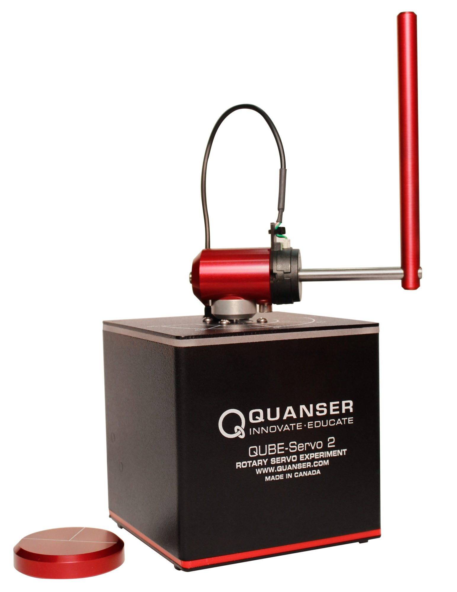

# Quanser OpenAI Driver
Has an OpenAI Gym wrapper for the Quanser Qube Servo 2 and Quanser Aero

- [Setup](#setup)
    - [Prerequisites](#prerequisites)
    - [Installation](#installation)
    - [Recompiling Cython](#recompiling-cython-code)
- [Basic Usage](#usage)
- [Warning](#warning)
    - [Quick fix](#the-fastest-solution-no-restart-required-is-to-remove-the-semaphore-of-the-board)
    - [(Slighly) easier fix](#the-easiest-solution-is-to-restart-note-the-order)


# Setup
We have tested on Ubuntu 16.04 LTS and Ubunbtu 18.04 LTS using Python 2.7. Should also work with Python 3.x<br>

### Prerequisites
Install the HIL SDK from Quanser. A mirror is available at https://github.com/BlueRiverTech/hil_sdk_linux_x86_64

### Installation
We recommend using [Pipenv](https://docs.pipenv.org/). Install dependencies found in the [Pipfile](./Pipfile) by running:<br>
```bash
    pipenv install # install the dependencies
    pipenv shell # activate the virtual environment
```

Once you have that setup: Run the classical control baseline<br>
- For the Qube: `python tests/test.py --env env QubeFlipUpEnv --control flip-up`
- For the Aero: `python tests/test.py --env AeroPositionEnv --control aero-classic`

### Recompiling Cython code:
This installs the Quanser wrapper by using the pre-compiled C code.
If you wish to modify the Quanser wrapper (the Cython code) you will need to `cd gym_brt/envs/QuanserWrapper` and then `make` to compile the changed Cython code.
You will need Cython installed to do this.


# Usage
Usage is very similar to most OpenAI gym environments but **requires** that you close the environment when finished.
Without safely closing the Env, bad things may happen. Usually you will not be able to reopen the board.

This can be done with a context manager using a `with` statement
```python
import gym
from gym_brt import QubeInvertedPendulumEnv

num_episodes = 10
num_steps = 250

with QubeInvertedPendulumEnv() as env:
    for episode in range(num_episodes):
        state = env.reset()
        for step in range(num_steps):
            action = env.action_space.sample()
            state, reward, done, _ = env.step(action)
```

Or can be closed manually by using `env.close()`
```python
import gym
from gym_brt import AeroPositionEnv

num_episodes = 10
num_steps = 250

env = AeroPositionEnv()
try:
    for episode in range(num_episodes):
        state = env.reset()
        for step in range(num_steps):
            action = env.action_space.sample()
            state, reward, done, _ = env.step(action)
finally:
    env.close()
```


# Warning
Forgetting to close the environment or incorrectly closing the env leads to several possible issues. The worst including segfaults.

The most common case when the env was not properly closed: you can not reopen the env and you get:
```
Error 1073: QERR_BOARD_ALREADY_OPEN: The HIL board is already opened by another process. The board does not support access from more than one process at the same time.
```

#### The fastest solution (no restart required) is to remove the semaphore of the board:
1. Find the location of the semaphore by `ls /dev/shm`.
    - It will start with `sem.qube_servo2_usb$xxxxxxxxxxxxx` (with the 'x's being some alphanumeric sequence).
1. Use the `rm` command to remove it.
    - Ex: `rm /dev/shm/sem.qube_servo2_usb$xxxxxxxxxxxxx` 

#### The easiest solution is to restart (note the order):
1. Unplug USB from the Qube/Aero
1. Unplug power from USB/Aero
1. Restart your computer
1. Replug power to Qube/Aero
1. Replug USB into the Qube/Aero
Once you restarted, you can try running the program again (with proper closing).


